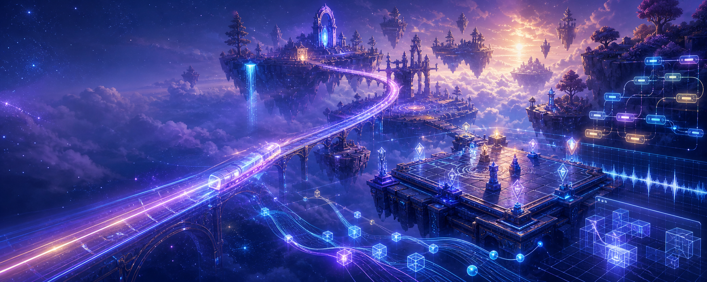

<div align="center">



<br>

# LuNa

### GAME CLIENT PROGRAMMER

**복잡한 게임 규칙을, 손맛이 느껴지는 플레이 경험으로 구현합니다.**<br>
*I turn complex gameplay rules into responsive, playable systems.*

<br>

[](https://github.com/LuNaU1F320/AstroRail)
[](https://github.com/LuNaU1F320/PokeRogue)
[](https://github.com/LuNaU1F320/AstroRail)
[](https://github.com/LuNaU1F320/PokeRogue)

<br>

[](mailto:lunau1f320@gmail.com)
[](https://github.com/LuNaU1F320)
[](#-featured-projects)

</div>

<br>

---

<br>

## ✦ About Me

전투의 **상태 흐름**, 플레이어의 **입력과 피드백**, 데이터를 실제 플레이로 연결하는 **게임플레이 시스템**에 집중합니다.<br>
기능 하나를 만드는 데서 끝내지 않고, 서로 영향을 주는 규칙을 명확한 책임과 데이터 흐름으로 설계하는 것을 좋아합니다.

<br>

```text
GAMEPLAY IDEA  →  SYSTEM DESIGN  →  DATA & STATE  →  PLAYER FEEDBACK
```

- 턴제 전투, 타겟팅, 상태 이상, 성장·보상 시스템
- Subsystem / Component / Service 기반 책임 분리
- DataTable · DataAsset · ScriptableObject · CSV/JSON · SaveGame
- Animation Notify · VFX · UI와 게임 판정의 동기화

<br>

---

<br>

## ✦ Featured Projects

### 01 / [AstroRail](https://github.com/LuNaU1F320/AstroRail)

`UNREAL ENGINE 5.7` · `C++` · `BLUEPRINT` · `2-PERSON TEAM`

**붕괴: 스타레일의 전투 구조를 UE5로 재구성한 3D 턴제 RPG**

필드 탐색과 전투 진입부터 캐릭터 획득, 파티 편성, 저장까지 하나의 플레이 흐름으로 구현했습니다. 단순한 턴 교대가 아니라 서로 개입하고 영향을 주는 전투 규칙을 독립적인 시스템으로 분리해 연결했습니다.

<br>

- AV 기반 행동 순서와 필살기 끼어들기
- 약점 격파와 7속성 상태 이상
- 다중 타겟팅과 입력 상태 제어
- 다중 페이즈 보스와 가중치 패턴
- 픽업·천장·확정 보정을 포함한 가챠
- 파티·보상·SaveGame 영속화

<br>

> **ROLE** — 전투 시스템 전반 · 캐릭터/적 데이터 · 파티 · 가챠 · 저장 · 전투 UI<br>
> **TEAM** — 2인 협업 · 2026.05–06

<br>

<p align="center">
  <a href="https://github.com/LuNaU1F320/AstroRail"></a>
  <a href="https://github.com/LuNaU1F320/AstroRail/releases"></a>
  <a href="https://app.notion.com/p/AstroRail-2fddbef4fbe582aabd20814f223d0796"></a>
</p>

<br><br>

### 02 / [PokeRogue](https://github.com/LuNaU1F320/PokeRogue)

`UNITY 2022.3` · `C#` · `SCRIPTABLEOBJECT` · `JSON`

Unity로 구현한 포켓몬 기반 턴제 로그라이크 RPG입니다. 전투 한 턴의 우선순위부터 상태 이상, 포획·도주, 다단계 성장과 저장까지 하나의 플레이 루프로 연결했습니다.

<br>

**Combat Systems**

- 턴 우선순위 · 데미지 공식 · 18타입 상성
- 콜백 기반 상태 이상 · 교체 · 스킬 실행 파이프라인

<br>

**Data & Tools**

- CSV → ScriptableObject 에디터 임포터
- JSON 스프라이트 애니메이션 · 런타임/원본 데이터 분리

<br>

**Player Flow**

- 포획 · 도주 · 파티 편성
- 레벨업 · 기술 학습 · 진화 · 저장 · 씬 전환

<br>

<p align="center">
  <a href="https://github.com/LuNaU1F320/PokeRogue"></a>
  <a href="https://youtu.be/HDGUY87Xfoc"></a>
  <a href="https://github.com/LuNaU1F320/PokeRogue/releases"></a>
  <a href="https://app.notion.com/p/Pok-Rogue-13cdbef4fbe58283899e01b6ce40241f"></a>
</p>

<br><br>

### 03 / [BandMixer](https://github.com/LuNaU1F320/BandMixer)

`UNITY` · `C#` · `AUDIO SYSTEM`

보컬·드럼·베이스·기타 스템을 독립적으로 제어하는 음악 세션 믹서입니다.

- 스템별 볼륨·뮤트와 동기화 재생
- 루프, 탐색, 재생 속도 제어
- BPM 기반 메트로놈과 오디오 UI

<br>

<p align="center">
  <a href="https://github.com/LuNaU1F320/BandMixer"></a>
</p>

<br>

---

<br>

## ✦ Tech Stack

<div align="center">

#### Engines & Languages


#### Gameplay & Data


</div>

<br>

---

<br>

<div align="center">

### LET'S BUILD SOMETHING PLAYABLE

게임의 규칙이 화면 위에서 살아 움직이는 순간을 만듭니다.

<br>

[](mailto:lunau1f320@gmail.com)

<br>

<sub>Building playable systems, one meaningful interaction at a time.</sub>

</div>
