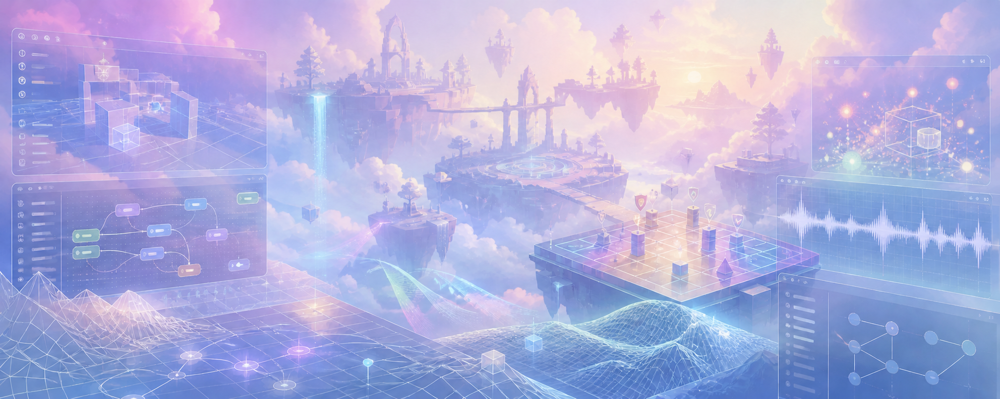

# LuNa

### 게임 클라이언트 프로그래머 · Game Client Programmer

`Unity` · `Unreal` · `Gameplay Systems`

게임의 규칙과 플레이 경험을 클라이언트 시스템으로 구현합니다. 
I build game client systems that turn gameplay ideas into playable experiences.

  

---

## Featured Projects

### [PokeRogue](https://github.com/LuNaU1F320/PokeRogue)

Unity로 구현한 턴제 로그라이크 RPG 프로젝트입니다. 
A turn-based roguelike RPG project built with Unity.

- 턴제 배틀 흐름과 행동 선택
- 파티·스킬 선택 및 포켓몬 진화
- 게임 저장과 씬 전환

### [BandMixer](https://github.com/LuNaU1F320/BandMixer)

음악 세션의 보컬·드럼·베이스·기타 스템을 독립적으로 재생하고 조작하는 Unity 오디오 믹서입니다. 
A Unity audio mixer for independently playing and controlling vocal, drum, bass, and guitar stems.

- 스템별 볼륨 조절과 뮤트
- 루프 재생, 탐색, 재생 속도 조절
- BPM 기반 메트로놈

---

## What I Work On

- 게임플레이 시스템과 상태 흐름
- 플레이어 입력과 UI 상호작용
- 클라이언트 기능을 실제 플레이 경험으로 연결하는 구조

---

## 기술 스택 · Tech Stack

  
  
  
  
  
  

---

## Portfolio

전체 포트폴리오는 정리 후 공개할 예정입니다. 
My full portfolio will be linked here once it is ready to share.

---

🎮 Building playable systems, one feature at a time.

