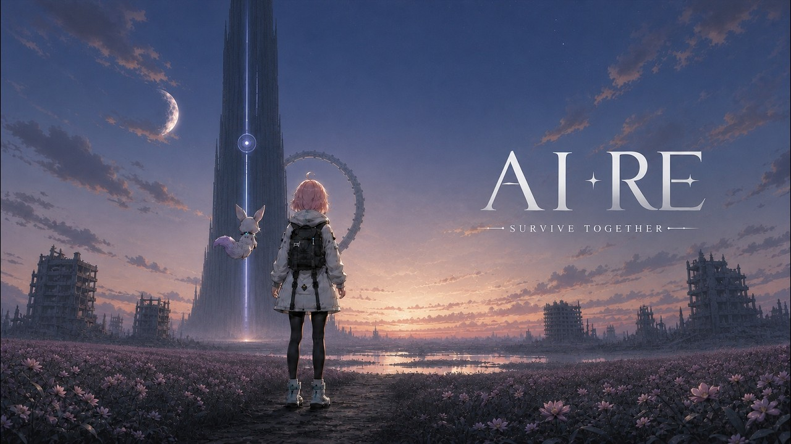
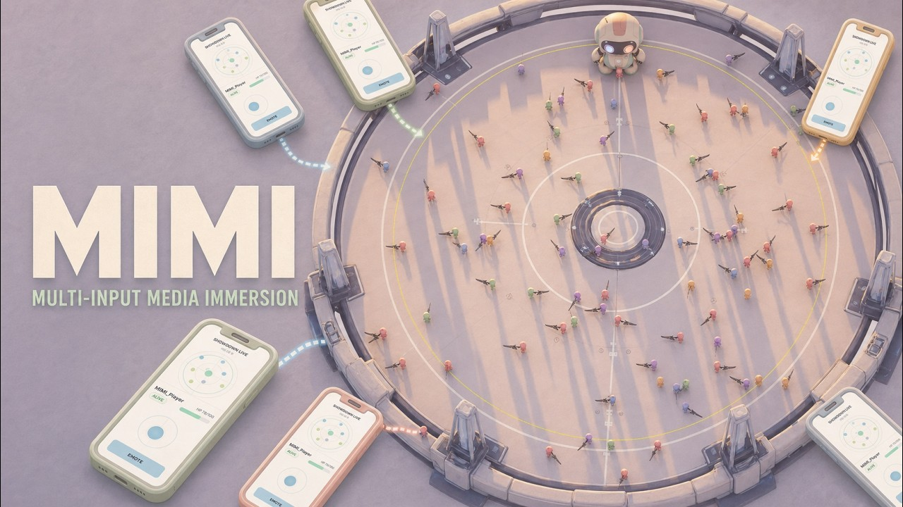
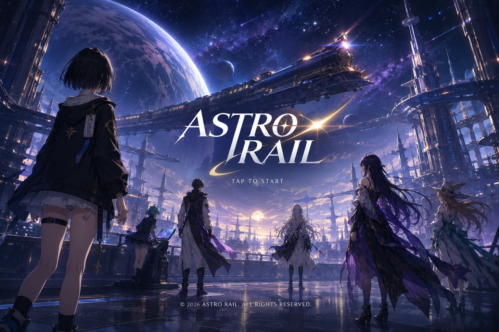
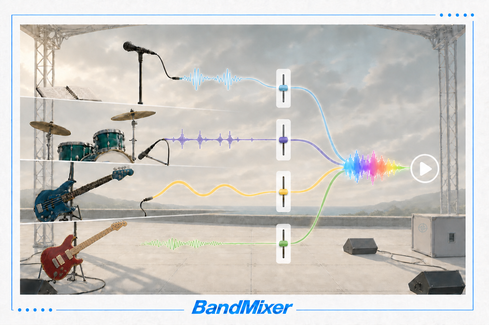
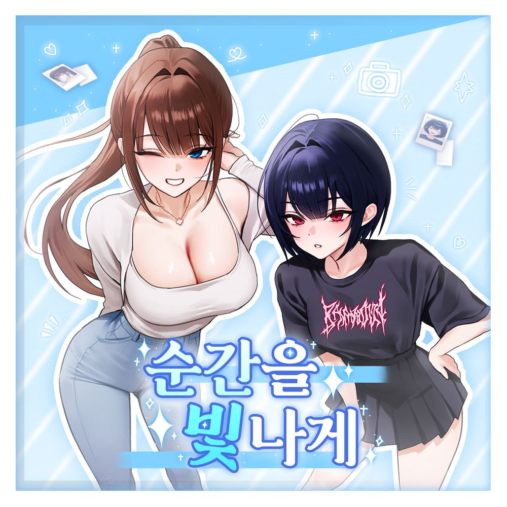
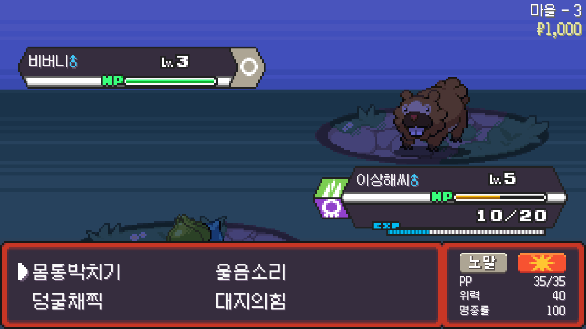

<div align="center">


<br>

# LuNa

### GAME CLIENT PROGRAMMER

**복잡한 게임 규칙을, 손맛이 느껴지는 플레이 경험으로 구현합니다.**<br>
*I turn complex gameplay rules into responsive, playable systems.*

<br>

[](https://github.com/LuNaU1F320/AstroRail)
[](https://github.com/LuNaU1F320/PokeRogue)
[](https://github.com/LuNaU1F320/AstroRail)
[](https://github.com/LuNaU1F320/PokeRogue)

<br>

[](mailto:lunau1f320@gmail.com)
[](https://github.com/LuNaU1F320)
[](#-public-repositories)
[](https://futuristic-capricorn-176.notion.site/Game-Client-Programmer-3c5dbef4fbe581238038cd809ce1646d)

</div>

<br>

---

<br>

## ✦ About Me

전투의 **상태 흐름**, 플레이어의 **입력과 피드백**, 데이터를 실제 플레이로 연결하는 **게임플레이 시스템**에 집중합니다.<br>
기능 하나를 만드는 데서 끝내지 않고, 서로 영향을 주는 규칙을 명확한 책임과 데이터 흐름으로 설계하는 것을 좋아합니다.

<br>

```text
GAMEPLAY IDEA  →  SYSTEM DESIGN  →  DATA & STATE  →  PLAYER FEEDBACK
```

- 턴제 전투, 타겟팅, 상태 이상, 성장·보상 시스템
- Subsystem / Component / Service 기반 책임 분리
- DataTable · DataAsset · ScriptableObject · CSV/JSON · SaveGame
- Animation Notify · VFX · UI와 게임 판정의 동기화

<br>

---

<br>

## ✦ Public Repositories

노션 포트폴리오에 정리된 프로젝트 중 소스가 공개된 저장소를 **최근 완료일 순**으로 정리했습니다.

| Project | Period | Stack | Public Repositories |
|:--|:--|:--|:--|
| **[AIRE](https://github.com/AIREProject/AI_RE)**<br>Unreal 기반 AI·Backend 연동 AX 프로젝트<br>2026 가상융합기술 아카데미 최우수상 | 2026.07–08 | Unreal 5.8 · C++ · Python · TypeScript | [Game Client](https://github.com/AIREProject/AI_RE) · [Server](https://github.com/AIREProject/AIRE_SERVER) · [Discord](https://github.com/AIREProject/AIRE_Discord) · [Web App](https://github.com/AIREProject/AIRE_WebApp) · [Kakao](https://github.com/AIREProject/AIRE_Kakao) · [Portfolio](https://futuristic-capricorn-176.notion.site/3cedbef4fbe58111a603e2d42c542416) |
| **[MIMI](https://github.com/LuNaU1F320/MIMI)**<br>관객의 모바일 입력을 Unreal 전장으로 연결한 참여형 배틀로얄<br>해커톤 3위 | 2026.06 | Unreal 5.7 · C++ · Blueprint · JavaScript | [Source](https://github.com/LuNaU1F320/MIMI) · [Portfolio](https://futuristic-capricorn-176.notion.site/3c3dbef4fbe580ef9666da5295424344) |
| **[AstroRail](https://github.com/LuNaU1F320/AstroRail)**<br>붕괴: 스타레일의 전투 구조를 재구성한 3D 턴제 RPG | 2026.05–06 | Unreal 5.7 · C++ · Blueprint | [Source](https://github.com/LuNaU1F320/AstroRail) · [Portfolio](https://futuristic-capricorn-176.notion.site/2fddbef4fbe582aabd20814f223d0796) |
| **[Band Mixer](https://github.com/LuNaU1F320/BandMixer)**<br>음악 세션 음원 분리 재생 프로그램 | 2025.08 | Unity · C# · Audio | [Source](https://github.com/LuNaU1F320/BandMixer) · [Portfolio](https://futuristic-capricorn-176.notion.site/775dbef4fbe58307a823810e43d8a0d2) |
| **[PokéRogue 모작](https://github.com/LuNaU1F320/PokeRogue)**<br>Unity로 구현한 턴제 로그라이크 RPG | 2025.02–04 | Unity 2022.3 · C# · ScriptableObject · JSON | [Source](https://github.com/LuNaU1F320/PokeRogue) · [Portfolio](https://futuristic-capricorn-176.notion.site/13cdbef4fbe58283899e01b6ce40241f) |

<br>

---

<br>

## ✦ Project Deep Dives

### 01 / [AIRE](https://github.com/AIREProject/AI_RE)

`UNREAL ENGINE 5.8` · `C++` · `PYTHON` · `TYPESCRIPT` · `2-PERSON TEAM`

<br>

<p align="center">
  <a href="https://github.com/AIREProject/AI_RE"></a>
</p>

<br>

**Unreal Gameplay와 Backend·LLM을 연결한 AI 동료 프로젝트**

게임 안에서는 StateTree와 GAS로 판단·전투·작업을 수행하고, 게임 밖에서는 사용자를 기억하는 AI 동료 **MAKO**를 구현했습니다. Backend와 LLM은 행동 후보를 제안하고, Unreal이 게임 규칙과 최종 상태 변경을 소유하도록 실행 경계를 설계했습니다.

<br>

- StateTree의 행동 판단과 GAS의 비용·쿨다운·피해·회복 실행 분리
- 데이터 기반 무기·콤보와 Layered Animation, 연속 프레임 근접 판정
- WorkOrder·Inventory·Equipment·SaveGame의 원자적 상태 변경과 복구
- LLM 제안을 Unreal의 결정적 규칙으로 재검증하는 Command Gateway
- Operation ID·State Version·Durable Outbox 기반 외부 작업 동기화
- Unreal·Mobile Web·Discord의 대화·기억·작업 상태 연속성

<br>

> **ROLE** — MAKO Gameplay · Unreal 연동 · Backend/DB/LLM · Mobile Web/Discord · 전체 데이터 흐름<br>
> **PROJECT** — 2인 협업 · 2026.07–08 · 2026 가상융합기술 아카데미 전체 2위 최우수상

<br>

<p align="center">
  <a href="https://github.com/AIREProject/AI_RE"></a>
  <a href="https://github.com/AIREProject/AIRE_SERVER"></a>
  <a href="https://github.com/AIREProject/AIRE_WebApp"></a>
  <a href="https://github.com/AIREProject/AIRE_Discord"></a>
  <a href="https://github.com/AIREProject/AIRE_Kakao"></a>
  <a href="https://youtu.be/3soAd3NUpdI"></a>
  <a href="https://futuristic-capricorn-176.notion.site/3cedbef4fbe58111a603e2d42c542416"></a>
</p>

<br><br>

### 02 / [MIMI](https://github.com/LuNaU1F320/MIMI)

`UNREAL ENGINE 5.7` · `C++` · `BLUEPRINT` · `JAVASCRIPT` · `5-PERSON HACKATHON`

<br>

<p align="center">
  <a href="https://github.com/LuNaU1F320/MIMI"></a>
</p>

<br>

**관객의 스마트폰을 Unreal 전장의 컨트롤러로 연결한 참여형 배틀로얄**

QR 또는 URL로 참가한 관객의 모바일 입력을 Unreal 캐릭터에 적용하고, 이동·충돌·전투·안전지대·생존 상태를 실시간으로 계산해 Host와 Mobile 화면으로 되돌려주는 플레이 흐름을 구현했습니다.

<br>

- 모바일 입력을 플레이어·봇 캐릭터에 적용하는 Realtime Input Bridge
- 안전지대 페이즈·존 데미지·보급품·사망·라운드 초기화
- 원형 전장 경계에서 접선 이동을 보존하는 위치 제어
- 현재·다음 안전지대, 플레이어와 보급품을 표시하는 미니맵
- 축소되는 안전지대를 추적하는 Quarter View 카메라
- 관객용 Mobile Web Controller와 발표자용 Host Dashboard

<br>

> **ROLE** — Unreal Battle Royale Gameplay · Host Dashboard · Mobile Web UI<br>
> **PROJECT** — 5인 해커톤 · 2026.06.17–19 · 해커톤 3위

<br>

<p align="center">
  <a href="https://github.com/LuNaU1F320/MIMI"></a>
  <a href="https://youtu.be/EVd6oI0k7bE"></a>
  <a href="https://futuristic-capricorn-176.notion.site/3c3dbef4fbe580ef9666da5295424344"></a>
</p>

<br><br>

### 03 / [AstroRail](https://github.com/LuNaU1F320/AstroRail)

`UNREAL ENGINE 5.7` · `C++` · `BLUEPRINT` · `2-PERSON TEAM`

<br>

<p align="center">
  <a href="https://github.com/LuNaU1F320/AstroRail"></a>
</p>

<br>

**붕괴: 스타레일의 전투 구조를 UE5로 재구성한 3D 턴제 RPG**

필드 탐색과 전투 진입부터 캐릭터 획득, 파티 편성, 저장까지 하나의 플레이 흐름으로 구현했습니다. 단순한 턴 교대가 아니라 서로 개입하고 영향을 주는 전투 규칙을 독립적인 시스템으로 분리해 연결했습니다.

<br>

- AV 기반 행동 순서와 필살기 끼어들기
- 약점 격파와 7속성 상태 이상
- 다중 타겟팅과 입력 상태 제어
- 다중 페이즈 보스와 가중치 패턴
- 픽업·천장·확정 보정을 포함한 가챠
- 파티·보상·SaveGame 영속화

<br>

> **ROLE** — 전투 시스템 전반 · 캐릭터/적 데이터 · 파티 · 가챠 · 저장 · 전투 UI<br>
> **PROJECT** — 2인 협업 · 2026.05–06

<br>

<p align="center">
  <a href="https://github.com/LuNaU1F320/AstroRail"></a>
  <a href="https://github.com/LuNaU1F320/AstroRail/releases"></a>
  <a href="https://futuristic-capricorn-176.notion.site/2fddbef4fbe582aabd20814f223d0796"></a>
</p>

<br><br>

### 04 / [Band Mixer](https://github.com/LuNaU1F320/BandMixer)

`UNITY 2022.3` · `C#` · `AUDIO SYSTEM` · `PERSONAL STUDY`

<br>

<p align="center">
  <a href="https://github.com/LuNaU1F320/BandMixer"></a>
</p>

<br>

**DSP Time으로 네 개의 Stem을 동기화하는 음악 세션 믹서**

보컬·드럼·베이스·기타 음원을 하나의 재생 위치와 속도로 제어하면서, 각 파트의 볼륨과 Mute 상태는 독립적으로 조절할 수 있도록 구현했습니다. 사용자가 폴더를 선택하면 파일 규칙에 따라 음원과 커버를 런타임에 구성합니다.

<br>

- 공통 DSP 기준 시각과 PlayScheduled를 이용한 4개 Stem 동기화
- BPM 기반 4박 Count-in과 예약 재생 수명주기 제어
- 폴더·파일명 규칙 기반 AudioClip·Cover 런타임 로딩
- Seek·Loop·Pause·재생 속도의 공통 상태 적용
- Pitch Shifter 보정과 Stem별 Volume·Mute 상태 복원

<br>

> **ROLE** — 기획 · Unity 클라이언트 구현<br>
> **PROJECT** — 개인 학습 프로젝트 · 2025.08.12–16

<br>

<p align="center">
  <a href="https://github.com/LuNaU1F320/BandMixer"></a>
  <a href="https://futuristic-capricorn-176.notion.site/775dbef4fbe58307a823810e43d8a0d2"></a>
</p>

<br><br>

### 05 / [순간을 빛나게](https://futuristic-capricorn-176.notion.site/142dbef4fbe5839a9f1601099e4cc2f4)

`UNITY 2022.3` · `C#` · `CSV` · `JSON` · `FREELANCE`

<br>

<p align="center">
  <a href="https://tumblbug.com/shine_themoment"></a>
</p>

<br>

**공개 데모와 펀딩으로 이어진 2D 비주얼 노벨 클라이언트 개발**

외주로 의뢰받은 펀딩용 데모를 2인으로 개발했습니다. 협업자가 UI 레이아웃을 담당하고, 저는 대사·연출 데이터 처리부터 입력, 세이브·로드, 설정, 사운드까지 클라이언트 시스템 전반을 구현했습니다.

<br>

- CSV 기반 대사·화자·배경·CG·BGM·SFX·음성 연출 파이프라인
- 수동 진행·자동·스킵을 분리한 입력 상태 제어
- 백로그·퀵 세이브/로드·슬롯 저장과 진행 지점 복원
- Master·BGM·SFX·Voice 음량과 텍스트·자동 진행 설정
- 타이틀부터 스토리 재생·저장·불러오기까지의 전체 플레이 흐름

<br>

> **ROLE** — UI 레이아웃을 제외한 클라이언트 개발 전반<br>
> **PROJECT** — 외주 프로젝트 · 2인 개발 · 2025.06–08 · 전체 소스 비공개

<br>

<p align="center">
  <a href="https://www.youtube.com/watch?v=MT6DTSo0nUQ"></a>
  <a href="https://tumblbug.com/shine_themoment"></a>
  <a href="https://store.onstove.com/ko/games/104618"></a>
  <a href="https://futuristic-capricorn-176.notion.site/142dbef4fbe5839a9f1601099e4cc2f4"></a>
</p>

<br><br>

### 06 / [PokeRogue](https://github.com/LuNaU1F320/PokeRogue)

`UNITY 2022.3` · `C#` · `SCRIPTABLEOBJECT` · `JSON`

<br>

<p align="center">
  <a href="https://github.com/LuNaU1F320/PokeRogue"></a>
</p>

<br>

**대규모 데이터와 전투·성장을 연결한 Unity 턴제 로그라이크 RPG**

웹 기반 PokéRogue의 핵심 시스템을 분석하고 Unity 환경에 맞게 재구성한 개인 프로젝트입니다. 전투 한 턴의 우선순위부터 상태 이상, 포획·도주, 다단계 성장과 저장까지 하나의 플레이 루프로 연결했습니다.

<br>

- 기술 우선도·속도 기반 턴 순서와 데미지 공식·18타입 상성
- 콜백 기반 상태 이상·교체·스킬 실행 파이프라인
- 649종 포켓몬과 813개 스킬의 CSV → ScriptableObject 자동화
- JSON 메타데이터 기반 런타임 스프라이트 애니메이션
- 포획·도주·파티 편성과 레벨업·기술 학습·진화
- 파티·개체 상태·재화·스테이지의 JSON 저장과 씬 전환

<br>

> **ROLE** — 게임 클라이언트 시스템 전반<br>
> **PROJECT** — 개인 프로젝트 · 2025.02.10–04.20

<br>

<p align="center">
  <a href="https://github.com/LuNaU1F320/PokeRogue"></a>
  <a href="https://youtu.be/HDGUY87Xfoc"></a>
  <a href="https://github.com/LuNaU1F320/PokeRogue/releases"></a>
  <a href="https://futuristic-capricorn-176.notion.site/13cdbef4fbe58283899e01b6ce40241f"></a>
</p>

<br>

---

<br>

## ✦ Tech Stack

<div align="center">

#### Engines & Languages


#### Gameplay & Data


</div>

<br>

---

<br>

<div align="center">

### LET'S BUILD SOMETHING PLAYABLE

게임의 규칙이 화면 위에서 살아 움직이는 순간을 만듭니다.

<br>

[](mailto:lunau1f320@gmail.com)

<br>

<sub>Building playable systems, one meaningful interaction at a time.</sub>

</div>
